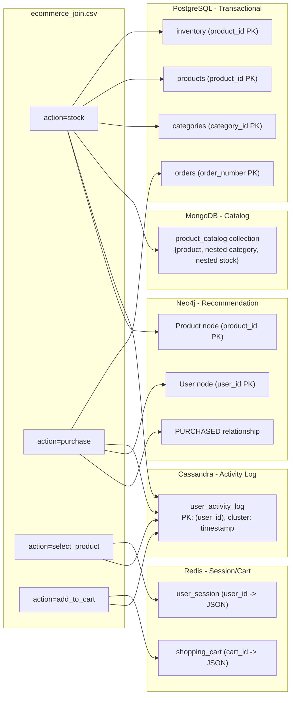

# E-commerce polyglot persistence demo (end-to-end)

## Context

The thesis (section 2.1, lines 107-111 of `_docs/polyglot-import-csv.md`) defines 5 e-commerce use cases. The current `import_config.json` partially maps them, but the alignment is off (e.g. MongoDB has orders instead of product catalog; Cassandra only logs `select_product` instead of all activity; Neo4j models Buyer-Seller instead of recommendation-friendly User-Product).

The source CSV is [`data/ecommerce/ecommerce_join.csv`](data/ecommerce/ecommerce_join.csv) (32 data rows, 4 action types: `stock`, `purchase`, `select_product`, `add_to_cart`). It already has flat columns for all 5 use cases -- no CSV changes needed.

## Proposed column-to-backend mapping

### 1. PostgreSQL -- Financial/Transactional + Inventory

- **orders**: `order_number` PK, `user_id`, `order_date`, `order_status`, `payment_method`, `quantity`, `product_id`, `price`, `comment`, `rating` -- filter `action == purchase` (8 rows)
- **inventory**: `product_id` PK, `quantity_available`, `last_restock_date`, `price` -- filter `action == stock` (8 rows)
- **products**: `product_id` PK, `product_name`, `product_variant`, `product_brand`, `category_id`, `price` -- no filter (deduped, ~8 products)
- **categories**: `category_id` PK, `category_name` -- no filter (deduped, ~8 categories)
- FK: `products.category_id -> categories.category_id`, `orders.product_id -> products.product_id`

### 2. MongoDB -- Product Catalog (documents)

- **product_catalog** collection: top-level product fields + nested `category` + nested `stock` subdocuments -- filter `action == stock` (8 documents)

### 3. Redis -- Shopping Cart + User Session

- **shopping_cart**: `shopping_cart_id` as key, JSON value `{cart_product_id, cart_quantity}` -- filter `action == add_to_cart` (8 keys)
- **user_session**: `user_id` as key, JSON value `{user_name, user_email, last_seen}` -- filter `action == select_product` (8 keys)

### 4. Cassandra -- User Activity Log (all events)

- **user_activity_log**: partition `user_id`, cluster `timestamp`; columns: `action`, `product_id`, `order_number`, `selected_product_id`, `shopping_cart_id` -- **no filter** (all 32 rows, sparse columns per action type)

### 5. Neo4j -- Recommendation Graph

- **User** nodes: `user_id` PK, `user_name`, `user_email` -- filter `action == purchase`
- **Product** nodes: `product_id` PK, `product_name`, `product_brand` -- filter `action == stock`
- **PURCHASED** relationship: User -> Product with `order_number`, `quantity`, `price`, `rating` -- enables "users who bought X also bought Y"

## Code fix needed

The Neo4j importer hardcodes `order_number` as the relationship MERGE key ([`neo4j_importer.py` line ~128](src/polyglotimportcsv/importers/neo4j_importer.py)). This works for the demo (purchases have `order_number`), but should be generalized to use the **first `is_key` column** in the relationship's `columns` config, or fall back to all columns. This is a small fix in `run_neo4j_import`.

## Execution steps

1. Rewrite [`data/ecommerce/import_config.json`](data/ecommerce/import_config.json) with the mapping above
2. Fix Neo4j importer relationship MERGE key (generalize beyond `order_number`)
3. Run `--dry-run` to validate config + counts
4. `docker compose up -d` and wait for all services to be ready
5. Run real import: `python -m polyglotimportcsv data/ecommerce/ecommerce_join.csv --config data/ecommerce/import_config.json`
6. Verify data in each DB via `docker exec` queries:
   - `psql`: SELECT from orders, inventory, products, categories
   - `redis-cli`: KEYS + GET for cart and session
   - `mongosh`: db.product_catalog.find()
   - `cqlsh`: SELECT from user_activity_log
   - `cypher-shell`: MATCH nodes and relationships
7. Add a test that validates the new config via dry-run
8. Commit and push

## CSV assessment

[`ecommerce_join.csv`](data/ecommerce/ecommerce_join.csv) is sufficient (32 rows, 4 actions, 8+ users, 8 products). No CSV changes needed.
