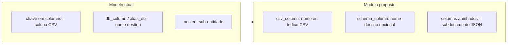
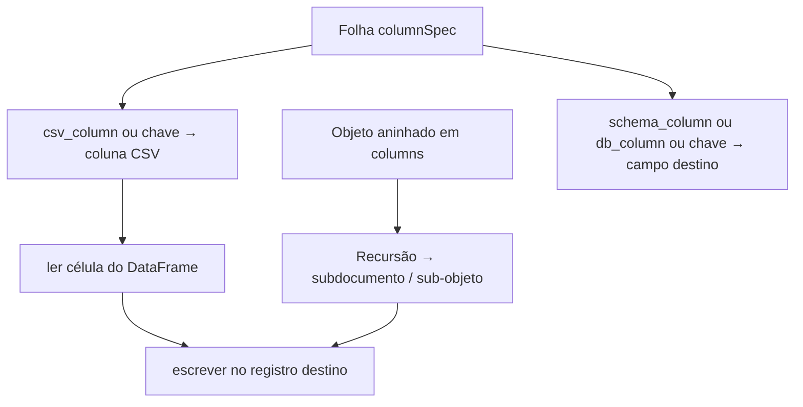
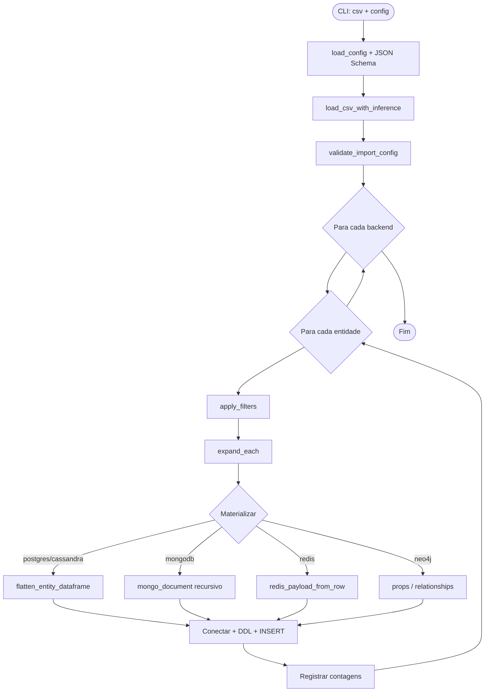

# Enriquecimento do relatório TCC: JSON Schema e algoritmo de importação

## Contexto atual

O relatório ([docs/LucasBuenoCesario-PolyglotImportCSV-Report-TCC1.md](docs/LucasBuenoCesario-PolyglotImportCSV-Report-TCC1.md)) descreve o formato de configuração em ~2 parágrafos (seções 4.2–4.3). O código já possui um JSON Schema embutido em [src/polyglotimportcsv/schemas/polyglot_import_config.schema.json](src/polyglotimportcsv/schemas/polyglot_import_config.schema.json), mas o mapeamento CSV→SGBD usa **a chave do objeto `columns` como nome da coluna CSV** e `db_column`/`alias_db` como renomeação — sem os campos explícitos sugeridos pelo orientador. O aninhamento MongoDB usa um bloco separado `nested`.



---

## Parte 1 — Revisão e evolução do JSON Schema (item 1.1)

### 1.1.1 Problemas identificados no schema atual

| Problema | Impacto |
|----------|---------|
| `entity.additionalProperties: true` | Typos (`column` vs `columns`) passam na validação JSON Schema |
| `columnSpec` sem campos obrigatórios | `{}` é válido; Postgres precisa de `db_type` só em runtime |
| Sem `csv_column` / `schema_column` | Mapeamento assimétrico e pouco legível no relatório |
| Bloco `nested` separado | Verboso; duplica estrutura que JSON já expressa com objetos aninhados |
| Testes mínimos ([tests/test_config_parser.py](tests/test_config_parser.py)) | Apenas 1 caso negativo de schema |

### 1.1.2 Novo modelo de mapeamento de colunas

**Campos em cada folha de mapeamento (`columnSpec`):**

- `csv_column` (opcional): `string` ou `integer` — nome do cabeçalho CSV **ou** índice da coluna (0-based). Se omitido, a chave do objeto pai identifica a coluna CSV (retrocompatível).
- `schema_column` (opcional): `string` — nome do atributo no SGBD destino. Se omitido, usa-se a chave do objeto pai (retrocompatível com o comportamento atual de `db_column`).
- `is_key`, `db_type` — mantidos como estão.
- `db_column` / `alias_db` — **mantidos como sinônimos depreciados** de `schema_column` (sem quebrar [data/ecommerce/import_config.json](data/ecommerce/import_config.json) até migração).

**Aninhamento MongoDB via chaves JSON aninhadas** (conforme sua preferência):

Em vez de:

```json
"columns": { "product_id": {} },
"nested": { "category": { "columns": { "category_id": {} } } }
```

Passa a ser:

```json
"columns": {
  "product_id": {},
  "category": {
    "category_id": { "csv_column": "cat_id" },
    "category_name": {}
  }
}
```

- Objetos aninhados em `columns` = subdocumentos BSON.
- Folhas = `columnSpec` (metadados de mapeamento).
- Backends planos (PostgreSQL, Redis, Cassandra, Neo4j nós/rels): **somente folhas** — validação semântica rejeita objetos aninhados em `columns`.

**Bloco `nested` legado:** mantido no schema e no código por compatibilidade; marcado como *deprecated* na documentação e nos testes. Migração do exemplo e-commerce para o novo formato.

### 1.1.3 Alterações no JSON Schema

Arquivo: [polyglot_import_config.schema.json](src/polyglotimportcsv/schemas/polyglot_import_config.schema.json)

- Introduzir `$defs/columnEntry` recursivo:

```json
"columnEntry": {
  "oneOf": [
    { "$ref": "#/$defs/columnSpec" },
    {
      "type": "object",
      "minProperties": 1,
      "additionalProperties": { "$ref": "#/$defs/columnEntry" }
    }
  ]
}
```

- Atualizar `entity.columns` para usar `columnEntry`.
- Estender `columnSpec`:

```json
"csv_column": { "oneOf": [{ "type": "string", "minLength": 1 }, { "type": "integer", "minimum": 0 }] },
"schema_column": { "type": "string", "minLength": 1 }
```

- `entity.additionalProperties: false` (exceto `nested` depreciado, se mantido).
- Adicionar `description` em `$defs` principais (version, filter, backends) para embasar a documentação do relatório.
- Bump opcional: `version: 2` no schema (ou manter `version: 1` com extensão retrocompatível — **recomendado manter v1** com extensão, para não forçar migração imediata).

### 1.1.4 Alterações no código Python

| Arquivo | Mudança |
|---------|---------|
| [entity_utils.py](src/polyglotimportcsv/entity_utils.py) | Novas funções `source_column_name(key, spec)`, `target_field_name(key, spec)`, `iter_column_tree(columns, path=())` que percorrem `columns` recursivo **e** bloco `nested` legado; resolver `csv_column` inteiro → nome real via `df.columns[i]` |
| [materialize.py](src/polyglotimportcsv/materialize.py) | `mongo_document_from_row` monta documento recursivamente a partir de `columns` aninhados; suporta múltiplos níveis (corrigindo limitação atual de 1 nível) |
| [validation.py](src/polyglotimportcsv/validation.py) | Rejeitar `columns` aninhados em backends planos; validar `csv_column` (string presente no CSV ou índice válido); manter checagens de filtros/FK/Cassandra |
| [schema_generator.py](src/polyglotimportcsv/schema_generator.py) | Usar `target_field_name` em vez de `output_column_name` direto |
| Importers (postgres, redis, cassandra, neo4j) | Sem mudança estrutural — consomem helpers atualizados |

Fluxo de resolução de coluna (nova lógica central):



### 1.1.5 Testes (TDD)

Novos/estendidos em [tests/](tests/):

- **`test_config_parser.py`**: casos negativos (tipo inválido em `csv_column`, backend desconhecido, `columns` vazio); positivos com `csv_column` string e inteiro.
- **`test_entity_utils.py`** (novo): resolução de nomes, árvore recursiva, compatibilidade `db_column`/`nested` legado.
- **`test_materialize.py`** (novo ou estender existente): documento Mongo com 2+ níveis de aninhamento; Postgres flatten ignora ramos aninhados (via validação prévia).
- **`test_validation_dry_run.py`**: coluna CSV referenciada só via `csv_column`; índice fora do intervalo; nested em postgres rejeitado.

Comando de verificação: `pytest tests/ -q`

### 1.1.6 Migração do exemplo

Atualizar [data/ecommerce/import_config.json](data/ecommerce/import_config.json):

- MongoDB `product_catalog`: substituir bloco `nested` por `columns` aninhados.
- Cassandra: trocar `db_column` por `schema_column` onde aplicável (demonstrar nomenclatura nova).
- Manter compatibilidade: rodar `load_config` + dry-run após migração.

---

## Parte 2 — Documentação do JSON Schema no relatório (item 1.2)

Expandir a seção **4.2** de [LucasBuenoCesario-PolyglotImportCSV-Report-TCC1.md](docs/LucasBuenoCesario-PolyglotImportCSV-Report-TCC1.md) com subseções estruturadas:

### 4.2.1 Estrutura raiz
- `version` (obrigatório), backends opcionais, `additionalProperties: false`.

### 4.2.2 Mapeamento de colunas (`columnSpec`)
- Tabela: campo | tipo | obrigatório | descrição.
- Exemplos lado a lado:
  - coluna CSV = coluna destino (forma mínima `{}`).
  - renomeação: `csv_column` + `schema_column`.
  - índice numérico quando cabeçalho ausente ou ambíguo.

### 4.2.3 Entidade (`entity`)
- `columns` (obrigatório, recursivo para MongoDB).
- `filters`: operadores, `each` + `target_suffix`.
- Cassandra: `cassandra_partition`, `cassandra_cluster`.
- Nota sobre `nested` legado (depreciado).

### 4.2.4 Blocos por backend
- Para cada um (postgres, mongodb, cassandra, redis, neo4j): `connection`, campos específicos, `entities`, `relationships` (Postgres FK / Neo4j arestas).
- Trecho JSON real extraído de `import_config.json` (e-commerce).

### 4.2.5 Validação estática
- JSON Schema (sintaxe) vs validação cruzada CSV (semântica) — referenciar [config_parser.py](src/polyglotimportcsv/config_parser.py) e [validation.py](src/polyglotimportcsv/validation.py).

**Reorganizar seção 4.3 atual** (validação/execução breve) para **4.4**, após o algoritmo.

---

## Parte 3 — Algoritmo de alto nível (item 2)

Nova seção **4.3 Algoritmo de execução da importação** no relatório, descrevendo o pipeline real implementado em [runner.py](src/polyglotimportcsv/runner.py):

### Fases do algoritmo (texto + pseudocódigo)

1. **Entrada**: `csv_path`, `config_path`, flags (`--dry-run`, `--create-schema`, `--only`).
2. **Carregar config**: parse JSON → `jsonschema.validate` contra schema embutido.
3. **Carregar CSV**: `read_csv(dtype=str)` → inferir *kinds* por coluna.
4. **Validar config × CSV**: colunas referenciadas, filtros, FKs, PK Cassandra, regras por backend.
5. **Para cada backend** configurado (e não filtrado por `--only`):
   - **Para cada entidade**:
     - Aplicar filtros (exceto `each`).
     - Expandir partições (`each` → múltiplas entidades/coleções).
     - **Materializar** registros conforme paradigma (tabela plana / documento aninhado / chave-valor / nó ou aresta).
     - Conectar ao SGBD (ou pular em `--dry-run`).
     - Criar schema se aplicável (Postgres DDL, Cassandra keyspace/tabela).
     - Persistir (INSERT, insert_many, SET, MERGE…).
6. **Saída**: log com contagens por entidade/backend.

### Diagrama mermaid (incluir no relatório)



### Exemplo concreto no relatório

Traçar **1 linha** do `ecommerce_join.csv` com `action=stock` mostrando:
- quais filtros se aplicam;
- documento Mongo resultante (`product_catalog` com subobjetos `category`, `stock`);
- linha Postgres (`inventory`);
- registro Cassandra (`user_activity_log` com renomeação `timestamp` → `event_time`).

Isso conecta teoria (persistência poliglota do cap. 2) com a implementação.

---

## Escopo e arquivos tocados

| Área | Arquivos |
|------|----------|
| Schema | `polyglot_import_config.schema.json` |
| Core | `entity_utils.py`, `materialize.py`, `validation.py`, `schema_generator.py` |
| Dados exemplo | `data/ecommerce/import_config.json` |
| Testes | `test_config_parser.py`, novos `test_entity_utils.py`, `test_materialize.py`, ajustes em `test_validation_dry_run.py` |
| Relatório | `docs/LucasBuenoCesario-PolyglotImportCSV-Report-TCC1.md` (seções 4.2–4.4) |

**Fora de escopo** (mencionar apenas se necessário): alterar `docs/polyglot-import-csv.md` (cópia do relatório), integração CI com Docker, GUI do TCC II.

---

## Ordem de execução recomendada

1. Testes para `csv_column`/`schema_column` e `columns` aninhados (red).
2. Implementar helpers em `entity_utils.py`.
3. Atualizar JSON Schema.
4. Adaptar `materialize.py`, `validation.py`, `schema_generator.py`.
5. Migrar `import_config.json`; green nos testes.
6. Escrever seções 4.2–4.4 do relatório com tabelas, exemplos e diagrama.
