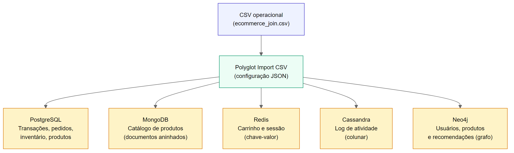
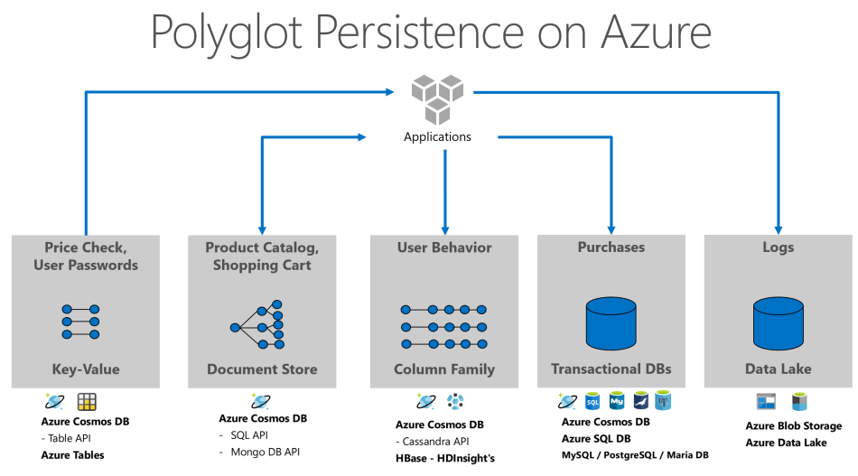
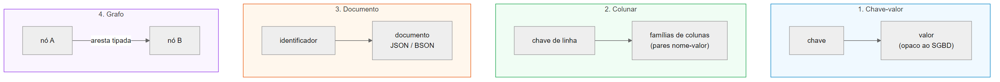
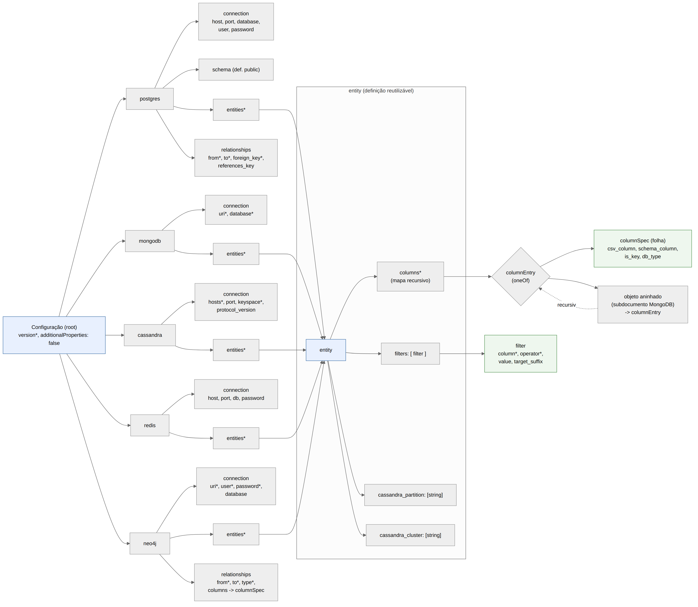
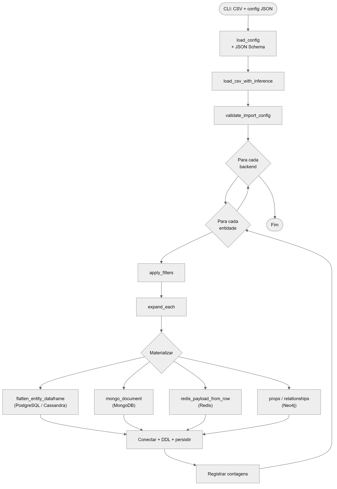

<!--
=======================================================================
  COMPILAÇÃO (a partir da raiz do repositório)
=======================================================================

  Bash (Git Bash / macOS / Linux, from repo root):
    ./docs-tcc/scripts/gerar-tcc1.sh             # PDF ABNT (oficial)
    ./docs-tcc/scripts/gerar-tcc1.sh --odt       # PDF + ODT para revisão (LibreOffice / Google Docs)

  Gera PDF (abnTeX2) e, com --odt, versão editável estilizada em docs-tcc/.
  Assets: abntex2.latex, abnt-ufsc-reference.odt, references.bib, CSL ABNT e images/.

=======================================================================
  CITAÇÕES (Pandoc / citeproc)
=======================================================================

  - [@chave]             → (AUTOR, ANO)
  - [@chave, p. 10]      → (AUTOR, ANO, p. 10)
  - @chave               → AUTOR (ANO)  — citação narrativa

=======================================================================
-->

# 1 INTRODUÇÃO

## 1.1 Visão Geral

Nas esferas industrial e acadêmica de bancos de dados, a concepção de que um único modelo de dados não atende a todas as necessidades tem conquistado aceitação, apontando para a perspectiva de persistência poliglota no futuro. Embora os sistemas de banco de dados relacionais devam manter sua predominância, espera-se uma convivência com diversas formas de sistemas, como os NoSQL [@sadalage2013nosql].

Algumas pesquisas têm sido feitas na área de persistência poliglota, como sugestões de modelos de dados unificados [@chillon2023propagating], comparação de desempenho de bancos de dados multi-modelos contra abordagens de persistência poliglota [@ye2023benchmark], revisões sistemáticas sobre modelagem poliglota de dados [@silva2024modelagem], tutoriais sobre o estado da arte e desafios abertos [@kiehn2022polyglot], e a adoção da persistência poliglota em Big Data [@khine2019review].

Percebe-se a falta de uma ferramenta única de importação de dados que possa realizar a persistência poliglota para diversos SGBDs que tratem modelos de dados diferentes. A proposta deste trabalho é apresentar a ferramenta *Polyglot Import CSV*, que importa dados armazenados em CSV para diferentes sistemas, baseada em uma configuração em JSON que aponta quais colunas do CSV formam cada entidade e relacionamento de cada SGBD.

CSV (Comma-Separated Values) é um arquivo de valores separados por vírgulas, frequentemente visualizado no Excel ou em alguma outra ferramenta de planilha. Pode haver outros tipos de valores como delimitadores, mas o mais comum é a vírgula. Muitos sistemas e processos hoje convertem seus dados para o formato CSV para saídas de arquivo para outros sistemas, relatórios amigáveis para humanos e outras necessidades. É um formato de arquivo padrão com o qual humanos e sistemas já estão familiarizados ao usar e manipular.

## 1.2 Objetivos

### 1.2.1 Objetivo Geral

Desenvolver a ferramenta *Polyglot Import CSV* que possibilitará a importação de dados em arquivos CSV para múltiplos SGBDs: PostgreSQL, Redis, MongoDB, Cassandra ou Neo4j.

### 1.2.2 Objetivos Específicos

- Fazer com que o arquivo de configuração JSON seja bem personalizável, seguindo uma sintaxe específica, porém flexível, além de adicionar opções como filtros e escolha de chave primária;
- Não permitir sintaxes de configuração incorretas; se a sintaxe estiver errada em algum lugar do arquivo de configuração, a importação não deve começar até que o arquivo de configuração esteja corrigido;
- Testar a ferramenta com um conjunto de dados armazenados num arquivo CSV que representa dados de um site de e-commerce.

## 1.3 Metodologia

Buscando obter conhecimento para realização do trabalho, primeiramente foi feito um estudo básico sobre o assunto, seguindo da implementação da solução, como descrito abaixo:

- Estudo sobre persistência poliglota e seu estado da arte;
- Estudo sobre os paradigmas relacional e não-relacionais que serão abrangidos pela solução, tais como: chave-valor, documento, grafo e colunar;
- Estudo de decisão de linguagem de implementação que demonstra melhor produtividade para codificar a solução;
- Implementação da solução "Polyglot Import CSV";
- Testes da solução "Polyglot Import CSV" implementada.

Na primeira etapa, foi estudado o que é a persistência poliglota, e a sua relevância no cenário atual.

Na segunda etapa, foram estudados os diversos modelos de dados: como cada modelo representa suas entidades; se há relacionamentos entre entidades no modelo; se é possível a existência de entidades aninhadas e multivaloradas; as limitações de cada modelo.

Na terceira etapa, foram estudadas as formas de implementar a solução usando as linguagens Java e Python e, pela simplicidade e produtividade, a linguagem Python foi escolhida.

As etapas de implementação e testes foram concluídas durante a elaboração deste TCC I, resultando no protótipo funcional descrito no Capítulo 4, validado com o conjunto de dados ``ecommerce_join.csv`` e o arquivo ``import_config.json`` do cenário e-commerce.

## 1.4 Estrutura do Trabalho

Este trabalho está estruturado em cinco capítulos principais. O primeiro aborda os objetivos, a metodologia e o contexto que levaram à elaboração deste TCC. O capítulo 2 revisa fundamentos teóricos. O capítulo 3 apresenta trabalhos relacionados. O capítulo 4 descreve a proposta da ferramenta *Polyglot Import CSV* e o capítulo 5 as atividades futuras (TCC II).

# 2 FUNDAMENTAÇÃO TEÓRICA

## 2.1 Persistência Poliglota

Em 2008, Neal Ford, em seu livro *The Productive Programmer* [@ford2008productive], introduziu o conceito de "programação poliglota" para expressar a ideia de que aplicativos devem ser desenvolvidos utilizando uma combinação de linguagens, aproveitando o fato de que diferentes linguagens são mais adequadas para lidar com diferentes problemas.

Uma das consequências notáveis da programação poliglota é a transição para a "persistência poliglota", usando a mesma analogia: pode-se dizer que múltiplas tecnologias de bancos de dados podem ser utilizados como armazenamento persistente para diferentes tipos de casos de uso. Embora ainda exista uma quantidade considerável de dados gerenciados em sistemas relacionais, a abordagem predominante passa a ser a reflexão sobre como se deseja manipular os dados antes de determinar qual tecnologia é a mais adequada para essa manipulação [@fowler2011polyglot].

A persistência poliglota abrange uma variedade de formatos de dados, incluindo estruturados, semi-estruturados e não estruturados. Especificamente, dados estruturados geralmente englobam formatos como relacional, chave-valor e em grafo. Dados semi-estruturados incluem principalmente documentos JSON e XML. Por fim, dados não estruturados são representados por arquivos de texto, bem como dados de bancos colunares [@ye2023benchmark].

A seguir, há um exemplo de aplicação prática da persistência poliglota em um e-commerce:

- **Dados Financeiros/Transacionais de Pagamento e Inventário de Produtos:** Esses dados podem ser armazenados em um banco de dados relacional, como o PostgreSQL.
- **Dados do Catálogo de Produtos:** Esses dados podem ser armazenados em um banco de dados NoSQL baseado em documentos, como o MongoDB.
- **Dados da Sessão do Carrinho de Compras e do Usuário:** Esses dados podem ser armazenados em um banco de dados NoSQL baseado em chave/valor, como o Redis.
- **Dados de Atividade do Usuário:** Estes dados podem ser armazenados em bancos de dados NoSQL colunares como o Apache Cassandra.
- **Dados de Recomendação:** Esses dados de recomendação podem ser armazenados em um banco de dados NoSQL baseado em grafos, como o Neo4j.

{width=15cm}

**Fonte:** Elaborado pelo autor (2026).

A Figura 2 apresenta um exemplo arquitetural de persistência poliglota em ambiente de nuvem (Microsoft Azure), no qual diferentes categorias de armazenamento atendem a casos de uso distintos (catálogo, carrinho, transações, logs etc.).

{width=15cm}

**Fonte:** Microsoft (s.d.). Adaptado pelo autor (2026).

## 2.2 Bancos de Dados NoSQL

Os bancos de dados NoSQL podem ser divididos em subcategorias com base em seus modelos de dados. Este trabalho utiliza a classificação de Hecht e Jablonski [@hecht2011nosql], que categoriza os bancos de dados NoSQL em quatro tipos principais: chave-valor, colunas, documentos e grafos.

A Figura 3 ilustra esses modelos, de forma respectiva:

{width=15cm}

**Fonte:** Elaborado pelo autor (2026).

### 2.2.1 Chave-valor

Os bancos de dados de chave-valor têm um modelo de dados simples baseado em pares de chave-valor, semelhante a um mapa associativo ou dicionário. A chave identifica exclusivamente o valor e é usada para armazenar e recuperar o valor no banco de dados, funcionando como uma chave primária. O valor pode ser usado para armazenar qualquer dado arbitrário, incluindo um número inteiro, uma string, um array ou um objeto, proporcionando um modelo de dados sem esquema.

Além disso, os bancos de dados de chave-valor são muito eficientes no armazenamento de dados distribuídos, mas não são adequados para cenários que requerem relações ou estruturas. Qualquer funcionalidade que requeira relações, estruturas ou ambas deve ser implementada na aplicação cliente que interage com o banco de dados de chave-valor.

Ora, como os valores são opacos para os bancos de dados, esses não podem lidar com consultas e indexações a nível de dados, podendo realizar consultas apenas por meio de chaves.

Um exemplo de banco de dados chave-valor é o Redis, que mantém os dados tanto na memória como no disco.

### 2.2.2 Colunar

Em bancos de dados colunares, o conjunto de dados consiste em várias linhas, cada uma identificada por uma chave de linha única, também conhecida como chave primária. Cada linha é composta por um conjunto de famílias de colunas, e diferentes linhas podem ter diferentes famílias de colunas. Semelhante aos bancos de dados de chave-valor, a chave de linha funciona como a chave, e o conjunto de famílias de colunas atua como o valor representado pela chave de linha. No entanto, cada família de colunas serve ainda como uma chave para uma ou mais colunas que contém, onde cada coluna consiste em um par nome-valor. O Cassandra oferece a funcionalidade adicional de supercolunas, que são criadas agrupando várias colunas.

Normalmente, os dados pertencentes a uma linha são armazenados juntos no mesmo nó do servidor. No entanto, o Cassandra pode distribuir uma única linha por vários nós de servidor usando chaves de partição compostas.

Nos bancos de dados de famílias de colunas, a configuração das famílias de colunas é tipicamente feita durante a inicialização. No entanto, a definição prévia de colunas não é necessária, oferecendo grande flexibilidade no armazenamento de qualquer tipo de dado.

Em geral, os bancos de dados de famílias de colunas fornecem capacidades de indexação e consulta mais poderosas do que os bancos de dados de chave-valor porque utilizam famílias de colunas e colunas além das chaves de linha.

Semelhante aos bancos de dados de chave-valor, qualquer lógica que exija relações deve ser implementada na aplicação cliente.

### 2.2.3 Documento

Bancos de dados orientados a documento armazenam registros como documentos autocontidos, em geral em JSON ou BSON. Cada documento possui um identificador e um conjunto de campos que podem variar entre documentos da mesma coleção, o que favorece esquemas flexíveis e agregados de leitura (*read-optimized*). O MongoDB é um exemplo popular: coleções de documentos, índices secundários e pipelines de agregação permitem consultas ricas sem exigir junções (*joins*) no servidor como no modelo relacional clássico.

Para o *Polyglot Import CSV*, o modelo documental é adequado a entidades com subestruturas aninhadas (por exemplo, um pedido com subdocumentos ``buyer`` e ``product``), desde que o CSV de origem exponha colunas planas que o mapeamento JSON agrupe em subdocumentos.

### 2.2.4 Grafo

Bancos de dados em grafo representam dados como **nós** (entidades) e **arestas** (relacionamentos tipados), com propriedades em ambos. Consultas exploram caminhos e vizinhanças de forma natural, o que é útil para recomendação, detecção de fraude e redes sociais. O Neo4j utiliza a linguagem Cypher para ``MERGE``/``CREATE`` de nós e relacionamentos.

Na ferramenta proposta, o destino grafo exige que o usuário declare explicitamente quais colunas do CSV identificam cada rótulo de nó e quais colunas alimentam propriedades do relacionamento (por exemplo, comprador $\rightarrow$ vendedor com atributos do pedido).

## 2.3 Bancos de Dados Multimodelo e Arquiteturas de Persistência Poliglota

SGBDs **multimodelo** integram mais de um paradigma de dados no mesmo motor (por exemplo, documento + chave-valor + grafo), oferecendo em geral uma interface de acesso unificada — como a linguagem AQL do ArangoDB, que combina filtros sobre JSON e travessias em grafos. Essa abordagem reduz o número de produtos operados, mas concentra riscos de *lock-in* e de *tuning* em um único fornecedor [@ye2023benchmark].

A **persistência poliglota**, por outro lado, combina **vários SGBDs heterogêneos**, cada um escolhido pela adequação a um caso de uso [@sadalage2013nosql]. Na literatura recente, essa ideia materializa-se como um **SGPD** (*Sistema de Gerenciamento Poliglota de Dados*): coordenação transparente entre tecnologias distintas, com requisitos de modelagem, expressividade de acesso (DDL/DML, consultas *key-based*, *set-based* e por caminhos em grafos) e capacidade de adaptação quando o *workload* evolui [@kiehn2022polyglot; @glake2022towards].

@tan2017query apresentam uma taxonomia útil para distinguir arquiteturas relacionadas: **BD federado** (fontes homogêneas, interface única), **BD multistore** (fontes heterogêneas, modelo canônico de consulta), **BD polystore** (fontes heterogêneas, múltiplas interfaces de acesso — exemplificadas por sistemas como o BigDAWG) e abordagens **multimodelo** (vários modelos no mesmo motor). A escolha entre essas arquiteturas não é trivial: @royhubara2022selecting propõem critérios para selecionar quais bancos usar em aplicações de persistência poliglota, destacando o trade-off entre especialização por SGBD e simplicidade operacional de um motor multimodelo.

@silva2024modelagem conduzem revisão sistemática sobre **modelagem poliglota de dados** — como particionar um esquema conceitual em fragmentos lógicos/físicos adequados a tecnologias distintas. Esse trabalho trata da fase de **projeto**; o presente TCC complementa-o na fase **operacional**, abordando a carga inicial de dados a partir de CSV.

O *Polyglot Import CSV* adota explicitamente a linha da persistência poliglota (não a multimodelo): o usuário direciona entidades e filtros para PostgreSQL, Redis, MongoDB, Cassandra e Neo4j conforme o padrão de acesso desejado, alinhado ao cenário e-commerce descrito na seção 2.1 e aos casos de uso discutidos por @kiehn2022polyglot.

# 3 TRABALHOS RELACIONADOS

## 3.1 Importação de arquivo CSV para um único SGBD

### 3.1.1 PostgreSQL

Primeiramente, você especifica a tabela com os nomes das colunas após a palavra-chave `COPY`. A ordem das colunas deve ser a mesma que aquelas no arquivo CSV.

```sql
COPY nome_da_tabela(col1, col2, col3)
FROM 'C:/caminho_do_arquivo/dados_de_amostra.csv'
DELIMITER ','
CSV HEADER;
```

Caso o arquivo CSV contenha todas as colunas da tabela, você não precisa especificá-las explicitamente.

Segundo, você insere o caminho do arquivo CSV após a palavra-chave `FROM`. Como o formato do arquivo é CSV, você precisa especificar `DELIMITER`, bem como as cláusulas `CSV`.

Terceiro, especifique a palavra-chave `HEADER` para indicar que o arquivo CSV contém um cabeçalho. Quando o comando `COPY` importa dados, ele ignora o cabeçalho do arquivo.

```sql
COPY nome_da_tabela
FROM 'C:/caminho_do_arquivo/dados_de_amostra.csv'
DELIMITER ','
CSV HEADER;
```

Observe que o arquivo deve ser lido diretamente pelo servidor PostgreSQL, não pela aplicação cliente. Portanto, ele deve ser acessível pela máquina do servidor PostgreSQL. Além disso, é necessário ter acesso de superusuário para executar com sucesso a instrução `COPY`.

### 3.1.2 Redis

A maneira preferida de importar dados em massa no Redis é gerar um arquivo de texto contendo o protocolo Redis, em formato bruto, para chamar os comandos necessários para inserir os dados requeridos.

Por exemplo, se precisar gerar um grande conjunto de dados com bilhões de chaves no formato "chaveN -> ValorN", deve ser um arquivo contendo os seguintes comandos no formato de protocolo Redis:

```text
SET Chave0 Valor0
SET Chave1 Valor1
...
SET ChaveN ValorN
```

Uma vez criado esse arquivo, a ação restante é alimentá-lo no Redis o mais rápido possível. No passado, a maneira de fazer isso era usar o netcat com o seguinte comando.

Nas versões 2.6 ou posteriores do Redis, a utilidade `redis-cli` suporta um novo modo chamado modo pipe que foi projetado para realizar o carregamento em massa.

Usando o modo pipe, o comando a ser executado parece o seguinte:

```bash
cat dados.txt | redis-cli --pipe
```

Isso produzirá uma saída semelhante a esta:

```text
All data transferred. Waiting for the last reply...
Last reply received from server.
errors: 0, replies: 1000000
```

A utilidade `redis-cli` também garantirá redirecionar apenas os erros recebidos da instância Redis para a saída padrão.

### 3.1.3 MongoDB

Como a ferramenta `mongoimport` é fornecida oficialmente, o processo de importar dados em formato CSV é muito simples. É uma ferramenta poderosa e fácil de usar. Segue abaixo a sua sintaxe:

```bash
mongoimport --db nome_do_db --collection nome_da_colecao \
  --type csv --headerline --ignoreBlanks \
  --file caminho/do/arquivo.csv
```

- `--db nome_do_db`: define em qual banco de dados importar os dados.
- `--collection nome_da_colecao`: define o nome da nova coleção. Se esse parâmetro for omitido, o nome da coleção será o mesmo que o nome do arquivo CSV.
- `--type csv`: o tipo de arquivo é CSV.
- `--headerline`: o conteúdo da primeira linha do CSV será o nome de cada campo.
- `--ignoreBlanks`: esse parâmetro pode ignorar valores em branco no arquivo.
- `--file`: arquivo CSV a ser importado.

### 3.1.4 Cassandra

Importar dados CSV para o Cassandra usando `sstableloader` envolve vários passos. O `sstableloader` é uma ferramenta de linha de comando fornecida com o Apache Cassandra para carregar grandes volumes de dados eficientemente.

Certifique-se de que o arquivo CSV está no formato adequado para o Cassandra. Isso geralmente envolve garantir que os tipos de dados e as colunas correspondam ao esquema da tabela no Cassandra.

O `sstableloader` requer que os dados estejam em um formato específico chamado SSTable. Para converter o CSV em SSTables, você pode usar a ferramenta `cqlsh` fornecida com o Cassandra. Execute algo como:

```bash
cqlsh -e "COPY keyspace_name.table_name TO 'output_directory';"
```

Agora você pode usar o `sstableloader` para carregar os dados. O comando geralmente se parece com isso:

```bash
sstableloader -d <hostname> -u <username> -pw <password> \
  output_directory/keyspace_name/table_name
```

- `<hostname>`: O endereço do nó Cassandra.
- `<username>`: O nome de usuário, se a autenticação estiver habilitada.
- `<password>`: A senha correspondente.

Este comando moverá os dados do diretório de saída para o Cassandra usando o `sstableloader`.

### 3.1.5 Neo4j

Usar `neo4j-admin` para importar grandes conjuntos de dados no Neo4j envolve alguns passos. Esta ferramenta de linha de comando é projetada para importações em massa eficientes.

Certifique-se de que seus arquivos CSV estejam estruturados corretamente e sigam o formato necessário para nós e relacionamentos.

Crie um banco de dados não povoado:

```bash
neo4j-admin create-db --database=nome_do_seu_banco_de_dados \
  --from=diretorio_com_arquivos_csv
```

Substitua `nome_do_seu_banco_de_dados` pelo nome desejado para o novo banco de dados. A opção `--from` especifica o diretório onde estão localizados seus arquivos CSV.

Execute o comando de importação com `neo4j-admin`. O comando exato depende do seu modelo de dados, mas pode se parecer com isto:

```bash
neo4j-admin import --database=nome_do_seu_banco_de_dados \
  --mode=csv \
  --nodes:Rotulo1 nos.csv \
  --nodes:Rotulo2 nos2.csv \
  --relationships:TIPO_RELACIONAMENTO relacionamentos.csv
```

Substitua *Rotulo1*, *Rotulo2*, *nos.csv*, *nos2.csv*, *TIPO_RELACIONAMENTO* e *relacionamentos.csv* pelos seus rótulos específicos e nomes de arquivo.

## 3.2 Importação de arquivo CSV para SGBD multimodelo

Ferramentas comerciais e de código aberto tratam de **migração** ou **modelagem** entre tecnologias heterogêneas, embora raramente com o foco deste TCC (um único CSV largo + regras declarativas + cinco paradigmas).

- **ArangoDB** é um SGBD multimodelo nativo (documento/chave-valor/grafo) com ``arangoimport`` para CSV; a importação é para **um** motor multimodelo, não para cinco backends independentes.
- **``mongoimport`` / ``COPY`` / ``redis-cli --pipe`` / ``cqlsh`` / ``neo4j-admin``** (seção 3.1) cobrem importação **para um único** produto por vez.
- **dbcrossbar** [@dbcrossbar2024] copia dados tabulares entre PostgreSQL, BigQuery, armazenamento em nuvem e CSV, incluindo conversão de esquemas; a ênfase é *pipeline* de migração, não mapeamento semântico de entidades aninhadas com filtros por valor.
- **Hackolade** [@hackolade2024polyglot] oferece *polyglot data modeling* com engenharia de esquema para dezenas de alvos; trata-se de **modelagem visual** e geração de artefatos, e não de um utilitário CLI único para importar um CSV operacional com validação prévia de filtros.

## 3.3 Considerações sobre os trabalhos relacionados

A literatura sobre **metamodelos unificados** para SQL e NoSQL (por exemplo, U-Schema [@berlanga2021unified]) e sobre **evolução de esquema** em ambientes heterogêneos [@chillon2023propagating] informa decisões de validação e de representação de entidades no JSON de configuração, mas não substitui uma ferramenta de *bulk import* orientada a CSV.

Surveys recentes convergem em desafios abertos da gestão poliglota de dados: migração automatizada entre stores quando o *workload* muda, planejamento de consultas entre sistemas, gestão de esquemas multi-modelo e preservação das propriedades não funcionais de cada SGBD [@kiehn2022polyglot; @glake2022towards]. @royhubara2022selecting tratam da **seleção de SGBDs** por fragmento de aplicação; @silva2024modelagem mapeiam o estado da arte em **modelagem poliglota**. Nenhum desses trabalhos implementa, contudo, um utilitário declarativo que receba um CSV operacional único e o materialize simultaneamente em cinco paradigmas distintos com validação estática prévia.

Sistemas **polystore** como o BigDAWG [@duggan2017bigdawg] e middlewares de portabilidade em nuvem [@wang2020cmc] tratam de **consultas federadas** e movimentação de dados em ecossistemas complexos. @tan2017query classificam essas soluções (federado, multistore, polystore, poliglota) e avaliam transparência, autonomia e heterogeneidade — eixos nos quais importadores nativos (seção 3.1) e ferramentas de migração (seção 3.2) também divergem, mas sem convergir para um pipeline único de ingestão.

Ferramentas como **dbcrossbar** [@dbcrossbar2024] e **Hackolade** [@hackolade2024polyglot] aproximam-se do domínio de integração de dados, porém com foco em *pipelines* de migração ou modelagem visual, respectivamente — não em regras declarativas sobre entidades aninhadas, filtros por valor (`each`) e validação por JSON Schema antes de qualquer conexão com SGBDs.

**Lacuna identificada:** a combinação de (i) um CSV largo como fonte operacional, (ii) configuração JSON validada estaticamente, (iii) materialização distinta por paradigma (relacional, chave-valor, documento, colunar, grafo) e (iv) modo *dry-run* para revisão prévia. O *Polyglot Import CSV* ocupa essa lacuna como ferramenta de **bootstrap de persistência poliglota** — carga inicial e reprodutível de dados — enquanto middlewares e polystores assumem dados já residentes ou consultas em tempo de execução. Trabalhos futuros podem integrar a ferramenta a mecanismos de migração adaptativa descritos por @kiehn2022polyglot e @glake2022towards.

# 4 A PROPOSTA DA FERRAMENTA PolyglotImportCSV

## 4.1 Visão geral

A ferramenta **PolyglotImportCSV** (pacote Python ``polyglot-import-csv``) lê um arquivo CSV e um arquivo de configuração JSON validado por um **JSON Schema** embutido. A CLI executa, em sequência:

1. Carregamento do CSV (como texto, para evitar erros de *parse* em campos com ``+`` em timestamps).
2. Inferência de *kinds* de coluna (inteiro, *float*, data/hora, texto) para validar operadores de filtro.
3. Validação cruzada: colunas referenciadas existem no CSV; relacionamentos PostgreSQL e Neo4j referenciam entidades conhecidas; chaves de partição Cassandra estão declaradas quando necessário.
4. Para cada backend configurado: aplicação de filtros (incluindo o operador ``each`` para particionar por valor distinto), materialização de entidades e importação (ou apenas resumo em ``--dry-run``).

Comando principal:

```bash
python -m polyglotimportcsv caminho/dados.csv \
  --config caminho/import_config.json \
  [--dry-run] \
  [--create-schema / --no-create-schema] \
  [--only postgres,redis]
```

## 4.2 Formato de configuração (JSON Schema)

O arquivo de configuração é um JSON validado estaticamente pelo **JSON Schema** embutido em ``src/polyglotimportcsv/schemas/polyglot_import_config.schema.json`` (rascunho 2020-12). A validação ocorre em ``config_parser.load_config`` antes de qualquer leitura do CSV ou conexão com SGBDs. O exemplo de referência do cenário e-commerce está em ``data/ecommerce/import_config.json``, alinhado ao CSV ``data/ecommerce/ecommerce_join.csv``.

O schema passou por uma **reforma de simplificação** (seção 4.2.6) cujo objetivo foi reduzir o vocabulário do comando ao mínimo necessário, eliminando campos redundantes ou depreciados. A representação completa, na forma universal de *JSON Schema*, e o diagrama de estrutura resultante são apresentados na seção 4.2.6.

### 4.2.1 Estrutura raiz

| Campo | Tipo | Obrigatório | Descrição |
|-------|------|-------------|-----------|
| ``version`` | inteiro ($\geq 1$) | sim | Versão do formato de configuração (atualmente ``1``). |
| ``postgres`` | objeto | não | Bloco de importação relacional. |
| ``mongodb`` | objeto | não | Bloco de importação documental. |
| ``cassandra`` | objeto | não | Bloco de importação colunar. |
| ``redis`` | objeto | não | Bloco de importação chave-valor. |
| ``neo4j`` | objeto | não | Bloco de importação em grafo. |

Propriedades adicionais na raiz são **rejeitadas** (``additionalProperties: false``), o que impede erros de digitação como ``postgress`` passarem despercebidos.

### 4.2.2 Mapeamento de colunas (`columnSpec`)

Cada **folha** do mapa ``columns`` descreve como um valor do CSV alimenta um atributo no destino. A chave JSON no mapa ``columns`` identifica o campo por omissão; quando o cabeçalho CSV ou o nome no schema diferem dessa chave, usam-se os campos explícitos abaixo.

| Campo | Tipo | Obrigatório | Descrição |
|-------|------|-------------|-----------|
| ``csv_column`` | *string* ou inteiro ($\geq 0$) | não | Nome do cabeçalho CSV **ou** índice da coluna (base 0). Se omitido, a chave JSON é o cabeçalho CSV. |
| ``schema_column`` | *string* | não | Nome do atributo no SGBD destino. Se omitido, usa-se a chave JSON. |
| ``is_key`` | booleano | não | Marca chave primária, chave de ``MERGE`` (Neo4j) ou chave Redis. |
| ``db_type`` | *string* | não | Tipo SQL/CQL para geração de DDL (PostgreSQL, Cassandra). |

Propriedades adicionais em um ``columnSpec`` são rejeitadas (``additionalProperties: false``). Apenas estes quatro campos — ``csv_column``, ``schema_column``, ``is_key`` e ``db_type`` — compõem o mapeamento de uma folha, resultado da reforma de simplificação descrita na seção 4.2.6.

**Forma mínima** — coluna CSV e destino com o mesmo nome:

```json
"product_id": {}
```

**Renomeação explícita** — cabeçalho CSV distinto do atributo no schema:

```json
"timestamp": { "schema_column": "event_time" }
```

**Índice numérico** — útil quando o CSV não possui cabeçalho ou o nome é ambíguo:

```json
"logical_key": { "csv_column": 0, "is_key": true }
```

**Chave lógica distinta do CSV e do schema:**

```json
"redis_key": { "csv_column": "user_id", "schema_column": "session_id", "is_key": true }
```

### 4.2.3 Entidade (`entity`)

Uma **entidade** representa um alvo lógico: tabela (PostgreSQL/Cassandra), coleção (MongoDB), rótulo de nó (Neo4j) ou entidade Redis.

| Campo | Tipo | Obrigatório | Descrição |
|-------|------|-------------|-----------|
| ``columns`` | objeto recursivo | sim | Mapa de mapeamentos; ver abaixo. |
| ``filters`` | lista | não | Predicados sobre o CSV completo antes da materialização. |
| ``cassandra_partition`` | lista de *strings* | não | Colunas CSV que formam a chave de partição. |
| ``cassandra_cluster`` | lista de *strings* | não | Colunas de agrupamento (*clustering*). |

**Aninhamento MongoDB via chaves JSON:** objetos aninhados em ``columns`` produzem subdocumentos BSON, espelhando a estrutura de um documento JSON. Após a reforma de simplificação (seção 4.2.6), o aninhamento é expresso **exclusivamente** por chaves aninhadas dentro de ``columns`` — não há mais um bloco ``nested`` separado:

```json
"columns": {
  "product_id": {},
  "category": {
    "category_id": {},
    "category_name": {}
  },
  "stock": {
    "quantity_available": {},
    "last_restock_date": {}
  }
}
```

Backends **planos** (PostgreSQL, Redis, Cassandra, Neo4j) aceitam apenas folhas em ``columns``; aninhamento é rejeitado na validação cruzada.

**Filtros** — cada item exige ``column`` e ``operator``:

| Operador | ``value`` | Efeito |
|----------|-----------|--------|
| ``==``, ``!=``, ``>``, ``<``, ``>=``, ``<=`` | escalar | Comparação sobre a coluna CSV. |
| ``in``, ``not_in`` | lista | Pertinência ao conjunto. |
| ``each`` | escalar (opcional) | Particiona a entidade por valores distintos da coluna; sufixo opcional em ``target_suffix``. |

Exemplo do e-commerce — apenas linhas de estoque alimentam o inventário:

```json
"filters": [{ "column": "action", "operator": "==", "value": "stock" }]
```

### 4.2.4 Blocos por backend

Cada backend opcional contém ``connection`` (credenciais) e ``entities``. PostgreSQL e Neo4j admitem ainda ``relationships``.

**PostgreSQL** — ``connection`` (host, port, database, user, password), ``schema`` (padrão ``public``), entidades planas com ``db_type``, e ``relationships`` para chaves estrangeiras:

```json
"relationships": {
  "product_category": {
    "from": "products",
    "to": "categories",
    "foreign_key": "category_id",
    "references_key": "category_id"
  }
}
```

**MongoDB** — ``connection.uri``, ``connection.database``; entidades com ``columns`` recursivos para subdocumentos.

**Cassandra** — ``connection.hosts``, ``keyspace``; entidades com ``cassandra_partition`` / ``cassandra_cluster`` e renomeação via ``schema_column``:

```json
"timestamp": { "schema_column": "event_time" },
"cassandra_partition": ["user_id"],
"cassandra_cluster": ["timestamp"]
```

**Redis** — exatamente uma coluna ``is_key`` por entidade; demais campos compõem o valor JSON.

**Neo4j** — nós em ``entities`` (um ``is_key`` cada); ``relationships`` declaram arestas tipadas com propriedades opcionais:

```json
"relationships": {
  "PURCHASED": {
    "from": "User",
    "to": "Product",
    "type": "PURCHASED",
    "columns": { "order_number": { "is_key": true }, "quantity": {} }
  }
}
```

### 4.2.5 Validação estática e cruzada

A validação ocorre em **duas camadas**:

1. **JSON Schema** (`config_parser.validate_config`) — sintaxe, tipos e propriedades permitidas.
2. **Validação cruzada CSV** (`validation.validate_import_config`) — colunas referenciadas existem no CSV; filtros coerentes; FKs PostgreSQL e arestas Neo4j referenciam entidades válidas; backends planos não usam ``columns`` aninhados; índices ``csv_column`` dentro do intervalo.

Qualquer falha levanta ``BusinessException`` e **impede** o início da importação, conforme o objetivo específico do TCC.

### 4.2.6 Reforma de simplificação e representação na forma universal

O *JSON Schema* de configuração passou por uma **reforma** orientada pelo princípio de manter o comando o mais simples possível: cada conceito deve ter **uma única** forma de ser expresso. Versões anteriores acumulavam campos redundantes, mantidos por retrocompatibilidade, que duplicavam funcionalidades já cobertas por ``csv_column``, ``schema_column`` e pelo mapa recursivo ``columns``. Esses campos foram removidos, conforme a Tabela a seguir.

| Campo removido | Substituto canônico | Justificativa |
|----------------|---------------------|---------------|
| ``db_column`` | ``schema_column`` | Sinônimo de renomeação no destino; redundante. |
| ``alias_db`` | ``schema_column`` | Segundo sinônimo da mesma operação de renomeação. |
| ``nested`` (em ``entity``) | chaves aninhadas em ``columns`` | O aninhamento de subdocumentos MongoDB já é expresso recursivamente pelo próprio mapa ``columns`` (``columnEntry``), tornando o bloco separado desnecessário. |

Com a reforma, o vocabulário de uma folha (``columnSpec``) reduz-se a quatro campos opcionais (``csv_column``, ``schema_column``, ``is_key``, ``db_type``) e o aninhamento documental fica concentrado em um único mecanismo. A motivação prática para manter ``csv_column`` e ``schema_column`` é que **nem sempre o nome da coluna no CSV coincide com o nome do atributo no banco de destino**: ``csv_column`` indica o nome — ou o índice numérico (base 0) — da coluna de origem no CSV, enquanto ``schema_column`` indica o nome do atributo correspondente no SGBD. Quando ambos coincidem com a chave JSON, nenhum dos dois é necessário (forma mínima ``"campo": {}``).

A reforma preserva a propriedade de *fechamento* do schema: em todos os níveis vale ``additionalProperties: false``, de modo que qualquer campo legado remanescente em configurações antigas é detectado na validação, em vez de ser silenciosamente ignorado.

**Diagrama de estrutura.** A Figura 4 apresenta a árvore de estrutura do schema reformado — da raiz aos blocos por backend, à definição reutilizável ``entity`` e à recursão ``columns → columnEntry → columnSpec`` que sustenta os subdocumentos MongoDB. O diagrama-fonte Mermaid encontra-se em ``docs-tcc/images/figure4-config-schema.mmd`` (campos obrigatórios marcados com ``*``).

{width=15cm}

**Fonte:** Elaborado pelo autor (2026).

**Representação na forma universal.** A seguir reproduz-se o documento *JSON Schema* completo na sua forma serializada canônica (rascunho 2020-12), tal como embutido em ``src/polyglotimportcsv/schemas/polyglot_import_config.schema.json``. Essa é a representação **universal** e portável do contrato de configuração: pode ser consumida por qualquer validador compatível com a especificação, independentemente de linguagem de programação.

```json
{
  "$schema": "https://json-schema.org/draft/2020-12/schema",
  "$id": "https://polyglot-import-csv.local/schemas/polyglot_import_config.schema.json",
  "title": "PolyglotImportCSV configuration",
  "description": "Declarative mapping from a wide CSV file to one or more database backends.",
  "type": "object",
  "required": ["version"],
  "properties": {
    "version": {
      "type": "integer",
      "minimum": 1,
      "description": "Configuration format version."
    },
    "postgres": { "$ref": "#/$defs/postgresBackend" },
    "mongodb": { "$ref": "#/$defs/mongoBackend" },
    "cassandra": { "$ref": "#/$defs/cassandraBackend" },
    "redis": { "$ref": "#/$defs/redisBackend" },
    "neo4j": { "$ref": "#/$defs/neo4jBackend" }
  },
  "additionalProperties": false,
  "$defs": {
    "columnSpec": {
      "type": "object",
      "description": "Leaf mapping from a CSV column to a destination field.",
      "properties": {
        "is_key": {
          "type": "boolean",
          "description": "Primary or merge key for the entity."
        },
        "csv_column": {
          "description": "CSV header name or 0-based column index when it differs from the JSON key.",
          "oneOf": [
            { "type": "string", "minLength": 1 },
            { "type": "integer", "minimum": 0 }
          ]
        },
        "schema_column": {
          "type": "string",
          "minLength": 1,
          "description": "Destination field name when it differs from the JSON key."
        },
        "db_type": {
          "type": "string",
          "description": "SQL/CQL type for DDL generation (PostgreSQL, Cassandra)."
        }
      },
      "additionalProperties": false
    },
    "columnEntry": {
      "description": "Either a leaf columnSpec or a nested object (MongoDB subdocuments).",
      "oneOf": [
        { "$ref": "#/$defs/columnSpec" },
        {
          "type": "object",
          "minProperties": 1,
          "additionalProperties": { "$ref": "#/$defs/columnEntry" }
        }
      ]
    },
    "filter": {
      "type": "object",
      "description": "Row predicate applied to the full CSV before materialization.",
      "required": ["column", "operator"],
      "properties": {
        "column": { "type": "string", "minLength": 1 },
        "operator": {
          "type": "string",
          "enum": ["==", "!=", ">", "<", ">=", "<=", "in", "not_in", "each"]
        },
        "value": {},
        "target_suffix": {
          "type": "string",
          "description": "With operator 'each', optional template; default is sanitized distinct value"
        }
      },
      "additionalProperties": false
    },
    "entity": {
      "type": "object",
      "description": "One logical target (table, collection, label, or Redis entity).",
      "required": ["columns"],
      "properties": {
        "columns": {
          "type": "object",
          "minProperties": 1,
          "additionalProperties": { "$ref": "#/$defs/columnEntry" }
        },
        "filters": {
          "type": "array",
          "items": { "$ref": "#/$defs/filter" }
        },
        "cassandra_partition": {
          "type": "array",
          "items": { "type": "string" },
          "description": "CSV/source column names forming the partition key (compound supported)"
        },
        "cassandra_cluster": {
          "type": "array",
          "items": { "type": "string" },
          "description": "Clustering columns (optional)"
        }
      },
      "additionalProperties": false
    },
    "postgresBackend": {
      "type": "object",
      "required": ["entities"],
      "properties": {
        "connection": {
          "type": "object",
          "properties": {
            "host": { "type": "string" },
            "port": { "type": "integer" },
            "database": { "type": "string" },
            "user": { "type": "string" },
            "password": { "type": "string" }
          },
          "additionalProperties": false
        },
        "schema": { "type": "string", "default": "public" },
        "entities": {
          "type": "object",
          "additionalProperties": { "$ref": "#/$defs/entity" }
        },
        "relationships": {
          "type": "object",
          "additionalProperties": {
            "type": "object",
            "required": ["from", "to", "foreign_key"],
            "properties": {
              "from": { "type": "string" },
              "to": { "type": "string" },
              "foreign_key": { "type": "string" },
              "references_key": { "type": "string" }
            },
            "additionalProperties": false
          }
        }
      },
      "additionalProperties": false
    },
    "mongoBackend": {
      "type": "object",
      "required": ["entities"],
      "properties": {
        "connection": {
          "type": "object",
          "properties": {
            "uri": { "type": "string" },
            "database": { "type": "string" }
          },
          "required": ["uri", "database"],
          "additionalProperties": false
        },
        "entities": {
          "type": "object",
          "additionalProperties": { "$ref": "#/$defs/entity" }
        }
      },
      "additionalProperties": false
    },
    "cassandraBackend": {
      "type": "object",
      "required": ["entities"],
      "properties": {
        "connection": {
          "type": "object",
          "properties": {
            "hosts": { "type": "array", "items": { "type": "string" } },
            "port": { "type": "integer" },
            "keyspace": { "type": "string" },
            "protocol_version": { "type": "integer" }
          },
          "required": ["hosts", "keyspace"],
          "additionalProperties": false
        },
        "entities": {
          "type": "object",
          "additionalProperties": { "$ref": "#/$defs/entity" }
        }
      },
      "additionalProperties": false
    },
    "redisBackend": {
      "type": "object",
      "required": ["entities"],
      "properties": {
        "connection": {
          "type": "object",
          "properties": {
            "host": { "type": "string" },
            "port": { "type": "integer" },
            "db": { "type": "integer" },
            "password": { "type": "string" }
          },
          "additionalProperties": false
        },
        "entities": {
          "type": "object",
          "additionalProperties": { "$ref": "#/$defs/entity" }
        }
      },
      "additionalProperties": false
    },
    "neo4jBackend": {
      "type": "object",
      "required": ["entities"],
      "properties": {
        "connection": {
          "type": "object",
          "properties": {
            "uri": { "type": "string" },
            "user": { "type": "string" },
            "password": { "type": "string" },
            "database": { "type": "string" }
          },
          "required": ["uri", "user", "password"],
          "additionalProperties": false
        },
        "entities": {
          "type": "object",
          "additionalProperties": { "$ref": "#/$defs/entity" }
        },
        "relationships": {
          "type": "object",
          "additionalProperties": {
            "type": "object",
            "required": ["from", "to", "type"],
            "properties": {
              "from": { "type": "string" },
              "to": { "type": "string" },
              "type": { "type": "string" },
              "columns": {
                "type": "object",
                "additionalProperties": { "$ref": "#/$defs/columnSpec" }
              }
            },
            "additionalProperties": false
          }
        }
      },
      "additionalProperties": false
    }
  }
}
```

**Fonte:** Elaborado pelo autor (2026).

## 4.3 Algoritmo de execução da importação

O núcleo da ferramenta está em ``runner.run_import``. A seguir descreve-se o fluxo de alto nível desde a linha de comando até a persistência em cada SGBD.

### 4.3.1 Fases do algoritmo

1. **Entrada** — caminho do CSV, caminho do JSON de configuração e flags: ``--dry-run``, ``--create-schema`` / ``--no-create-schema``, ``--only`` (lista de backends).
2. **Carregar configuração** — ``load_config``: parse JSON + ``jsonschema.validate`` contra o schema embutido.
3. **Carregar CSV** — ``load_csv_with_inference``: leitura com ``dtype=str`` (evita erros de *parse* em timestamps com ``+``) e inferência de *kind* por coluna (``integer``, ``float``, ``datetime``, ``string``, ``empty``).
4. **Validar config × CSV** — ``validate_import_config``: checagens semânticas descritas na seção 4.2.5.
5. **Para cada backend** presente na configuração e não filtrado por ``--only``:
   - **Para cada entidade** declarada em ``entities``:
     - Aplicar filtros (exceto operador ``each``) sobre o DataFrame completo.
     - Expandir partições ``each`` (opcional) — uma entidade lógica pode gerar várias tabelas/coleções com sufixo.
     - **Materializar** registros conforme o paradigma do backend:
       - PostgreSQL / Cassandra: ``flatten_entity_dataframe`` — seleção, renomeação, deduplicação por ``is_key``.
       - MongoDB: ``mongo_document_from_row`` — documento recursivo a partir de ``columns`` aninhados.
       - Redis: ``redis_payload_from_row`` — par (chave, valor JSON).
       - Neo4j: propriedades de nós; depois ``MERGE`` de arestas a partir de ``relationships``.
     - Conectar ao SGBD (omitido em ``--dry-run``).
     - Criar schema se ``--create-schema`` (DDL PostgreSQL/Cassandra).
     - Persistir (``INSERT``, ``insert_many``, ``SET``, ``MERGE`` Cypher, etc.).
6. **Saída** — linhas de log com contagens por entidade/backend.

### 4.3.2 Pseudocódigo

```
função run_import(csv_path, config_path, dry_run, create_schema, only):
    config ← load_config(config_path)
    df, kinds ← load_csv_with_inference(csv_path)
    validate_import_config(config, df, kinds)

    para cada backend em (postgres, mongodb, cassandra, redis, neo4j):
        se backend nao esta em config ou nao esta em only: continuar
        linhas ← run_{backend}_import(config[backend], df, kinds,
                                       dry_run, create_schema)
        registrar linhas no log
```

Dentro de cada ``run_*_import``, para cada entidade:

```
    df_filtrado ← apply_filters(df, filtros_sem_each)
    para cada (nome_partição, df_parte) em expand_each(...):
        registros ← materializar(df_parte, entidade, backend)
        se não dry_run: conectar, DDL se necessário, gravar registros
```

### 4.3.3 Diagrama do fluxo

A Figura 5 resume o pipeline de execução descrito acima. O diagrama-fonte Mermaid encontra-se em ``docs-tcc/images/figure5-import-algorithm.mmd`` para futuras revisões.

{width=12cm}

**Fonte:** Elaborado pelo autor (2026).

### 4.3.4 Exemplo: uma linha `action=stock` no e-commerce

Considere uma linha do ``ecommerce_join.csv`` com ``action = stock``, contendo ``product_id``, ``category_id``, ``quantity_available``, ``timestamp``, etc.

| Backend | Entidade | Filtro aplicado | Saída materializada |
|---------|----------|-----------------|---------------------|
| PostgreSQL | ``inventory`` | ``action == stock`` | Linha plana: ``product_id``, ``quantity_available``, ``last_restock_date``, ``price``. |
| MongoDB | ``product_catalog`` | ``action == stock`` | Documento com campos de produto e subobjetos ``category`` e ``stock`` aninhados. |
| Cassandra | ``user_activity_log`` | nenhum (todas as linhas) | Registro com ``timestamp`` renomeado para ``event_time``, ``action`` para ``event_type``; PK composta ``(user_id, timestamp)``. |
| Redis | — | — | Entidades Redis usam outros filtros (``add_to_cart``, ``select_product``); esta linha não alimenta Redis. |
| Neo4j | ``Product`` | ``action == stock`` | Nó ``:Product`` com ``product_id`` como chave de ``MERGE``. |

Assim, um **único CSV largo** alimenta destinos heterogéneos: tabelas relacionais filtradas por tipo de evento, documentos aninhados, log colunar com renomeação de colunas e nós de grafo — materializando a persistência poliglota descrita no capítulo 2.

## 4.4 Validação e execução

Erros de configuração levantam ``BusinessException`` antes de qualquer conexão. O modo ``--dry-run`` lista contagens por entidade sem contatar os SGBDs. O *driver* Apache Cassandra é importado de forma tardia para permitir ``--dry-run`` em ambientes onde a extensão C do *driver* não está disponível (por exemplo, versões recentes do Python).

Testes automatizados (``pytest``) cobrem validação de schema, mapeamento de colunas (``csv_column``, ``schema_column``, aninhamento), filtros e *smoke tests* de validação + *dry-run*. O arquivo ``docker-compose.yml`` na raiz sobe PostgreSQL, Redis, MongoDB, Cassandra e Neo4j para testes de integração manuais; o script ``run_example.sh`` orquestra a subida dos contêineres, um *dry-run* e a importação real com ``--create-schema``.

### 4.4.1 Evidência de execução (cenário e-commerce)

O arquivo ``data/ecommerce/ecommerce_join.csv`` contém 32 linhas de eventos (``stock``, ``purchase``, ``add_to_cart``, ``select_product``). Com ``import_config.json`` e a flag ``--dry-run``, a ferramenta reporta as contagens abaixo sem abrir conexões com os SGBDs — útil para revisar o mapeamento antes da carga:

| Backend | Destino | Registros (após filtros / deduplicação) |
|---------|---------|----------------------------------------|
| PostgreSQL | ``categories`` | 8 |
| PostgreSQL | ``products`` | 8 |
| PostgreSQL | ``inventory`` | 8 |
| PostgreSQL | ``orders`` | 8 |
| MongoDB | ``product_catalog`` | 8 documentos |
| Cassandra | ``user_activity_log`` | 32 linhas (todas as ações) |
| Redis | ``shopping_cart`` | 8 |
| Redis | ``user_session`` | 8 |
| Neo4j | nó ``User`` | 8 |
| Neo4j | nó ``Product`` | 8 |
| Neo4j | aresta ``PURCHASED`` | conforme linhas ``purchase`` |

Com ``docker compose up -d`` e ``run_example.sh`` (ou importação sem ``--dry-run``), os mesmos volumes são persistidos nos cinco backends configurados, materializando o cenário poliglota da seção 2.1.

# 5 ATIVIDADES FUTURAS

- **Interface gráfica desktop** (semestre seguinte) que monte o comando CLI e visualize o JSON de configuração.
- **Suporte a TSV/Excel** e a *chunked* processing para CSV maiores que a RAM.
- **Operadores de filtro adicionais** e políticas de coerção de tipos configuráveis.
- **Testes de integração** contra ``docker compose`` em CI.
- **Generalização** do núcleo de importação para novos conectores (mensageria, *data lakes*, outros SGBDs).

# CONSIDERAÇÕES FINAIS

Este TCC I apresentou a fundamentação teórica da persistência poliglota, o estado da arte em importação e modelagem de dados heterogêneos, e a proposta da ferramenta *Polyglot Import CSV* como utilitário de *bootstrap* declarativo a partir de CSV.

As principais contribuições desta etapa são: (i) um formato de configuração JSON validado estaticamente por JSON Schema, com mapeamento recursivo de colunas e filtros por valor; (ii) um protótipo em Python que materializa o mesmo CSV operacional em PostgreSQL, MongoDB, Cassandra, Redis e Neo4j; (iii) o modo ``--dry-run`` para revisão prévia de contagens; e (iv) o cenário e-commerce reprodutível com ``ecommerce_join.csv``, ``import_config.json`` e ``docker-compose.yml``.

As limitações reconhecidas incluem: testes automatizados predominantemente unitários (sem suíte de integração contínua contra Docker); processamento em memória do CSV inteiro; e dependência do *driver* Cassandra em ambientes Python recentes. Itens como interface gráfica, suporte a TSV/Excel, *chunked* processing e novos conectores permanecem no escopo do TCC II (Capítulo 5).

O trabalho de conclusão de curso em dezembro de 2026 poderá aprofundar a avaliação experimental (desempenho, consistência entre stores) e a interface de uso, consolidando a ferramenta como artefato de pesquisa e de código aberto alinhado à literatura sobre SGPD e modelagem poliglota de dados.

```{=latex}
\postextual
```
