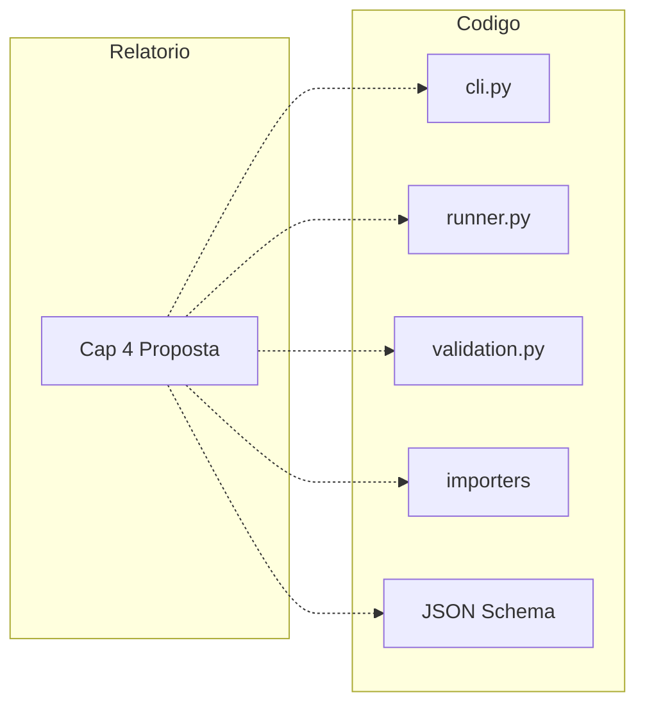

# Brainstorming TCC I — Polyglot Import CSV

**Documento derivado do chat com o agente Cursor (Superpowers / brainstorming)**  
**Período coberto:** a partir do pedido inicial de análise do progresso do TCC até o plano aprovado e execução parcial.  
**Autor do projeto:** Lucas Bueno Cesario  
**Data de compilação:** 27/05/2026

---

## 1. Pedido inicial

> Agora, pegue tudo que foi produzido de código-fonte em `src`, relatórios em `docs-tcc` e tudo mais que há em `polyglot-import-csv` e faça um **"brainstorming"** usando o Superpowers analisando o progresso do meu TCC, e se há coisas a serem corrigidas. Me faça perguntas quando achar necessário.

**Contexto:** o plugin Superpowers do Cursor define um fluxo de brainstorming (explorar contexto → perguntas → abordagens → design → spec). O pedido foi adaptado à **revisão do TCC I** (relatório + protótipo), não a um produto novo do zero.

---

## 2. Exploração do contexto do projeto

### 2.1 Visão geral do progresso

| Dimensão | Status | Nota (0–10) |
|----------|--------|-------------|
| **Código (protótipo)** | Funcional, 5 backends, JSON Schema, CLI, 29 testes | **8** |
| **Relatório (conteúdo)** | Capítulos 1–5 preenchidos, refs recentes, figuras | **7,5** |
| **Relatório (consistência)** | Contradições metodologia vs cap. 4, comentários obsoletos | **5,5** |
| **Evidência experimental** | Dry-run testado; import real pouco documentado | **4** |
| **Formatação ABNT** | PDF abnTeX2 ok; ODT para revisão; paths `docs/` desatualizados | **7** |
| **Entrega administrativa** | Ratificação presente em `docs-tcc/ratificacao/` | **?** |

**Síntese:** o TCC I está **defensável como proposta + protótipo de pesquisa**, não como produto maduro. O maior risco na banca tende a ser **narrativa desalinhada** (texto diz “em andamento” enquanto o cap. 4 descreve ferramenta pronta) e **falta de resultados mensuráveis** (tabela de contagens, log de import real).

### 2.2 Pontos fortes (manter na defesa)

**Código (`src/`):**

- Arquitetura em camadas: CLI → `runner` → validação → importadores injetáveis.
- JSON Schema embutido + validação em duas fases (schema + CSV).
- Cinco backends no mesmo CSV e-commerce: PostgreSQL, Redis, MongoDB, Cassandra, Neo4j.
- Modo `--dry-run` para demonstração sem infraestrutura.
- 29 testes `pytest` passando.

**Relatório (`docs-tcc/`):**

- Estrutura clássica TCC I (introdução, fundamentação, relacionados, proposta, futuros).
- Seções 2.3 e 3.3 alinhadas à literatura recente (SGPD, Kiehn, Roy-Hubara, Silva/ERBD).
- Cap. 4.2–4.3 técnicos: schema, algoritmo, pseudocódigo, figura 4.
- Folha de orientadores, figuras renomeadas (`figureN-*.png`), citações do material do orientador.

**Infra e demo:**

- `docker-compose.yml` com os cinco serviços.
- Dados em `data/ecommerce/` (`ecommerce_join.csv`, `import_config.json`).

### 2.3 Lacunas e correções sugeridas

#### P0 — Antes de entregar o PDF final

1. **Metodologia (§1.3):** ainda dizia que implementação e testes estavam “em andamento”, contradizendo o Capítulo 4.
2. **Comentários HTML no `.md`:** bloco “SEÇÕES PENDENTES” listando rascunhos já preenchidos.
3. **Paths de build:** comentário de compilação citava `docs/scripts` em vez de `docs-tcc/scripts`.
4. **Terminologia:** “O ficheiro” no §4.4 → “O arquivo” (ABNT brasileira).

#### P1 — Fortalecem a defesa

5. **Conclusão / Considerações finais** do TCC I (½–1 página).
6. **Evidência de execução** no §4.4 (tabela de contagens do `--dry-run` e/ou import Docker).
7. **§3.1.4 Cassandra:** texto sobre `sstableloader` vs implementação real via driver Python (`INSERT`).
8. **Precisão da validação:** esclarecer ordem JSON Schema → depois CSV.
9. **Bibliografia:** `urldate` em `@misc` web; DOIs quando houver.
10. **Lista de siglas:** incluir **SGPD**.
11. **Neal Ford (§2.1):** citação formal de *The Productive Programmer*.

#### P2 — Qualidade e TCC II

12. Testes unitários/smoke, sem integração contínua com Docker.
13. README com referências `_docs/` ou `docs/` desatualizadas.
14. Figura 2 (Azure): atribuição Microsoft / uso de material adaptado.
15. Ratificação: atualizar após edições finais do texto.
16. Cassandra + Python 3.12+: documentar limitação do driver se relevante.

### 2.4 Alinhamento relatório ↔ código



O relatório descreve com fidelidade o pipeline `load_config` → `load_csv` → `validate_import_config` → `run_*_import`, desde que o texto não contradiga o estado “concluído” do protótipo.

---

## 3. Perguntas de clarificação e respostas

### Pergunta 1 — Prazo e entregável

**Pergunta:** Qual a data prevista para a defesa do TCC I e o que a banca exige?

**Resposta do autor:**

- **TCC I:** entrega em **1º de julho de 2026**; entregável = relatório em `docs-tcc/`.
- **TCC II:** defesa com apresentação e banca por volta de **1º de dezembro de 2026**.

### Pergunta 2 — Escopo do brainstorming

**Pergunta:** Qual o foco principal do plano?

**Resposta do autor:**

- Relatório precisa estar **pronto**.
- Código cobre **apenas o que está no relatório**; não implementar o que está em “Trabalhos Futuros”.
- **Running example** com `ecommerce_join.csv` como **MVP**.

### Pergunta 3 — Estado do exemplo e-commerce

**Pergunta:** Qual o estado atual do running example?

**Resposta do autor:**

- Refazer todo o running example com **Docker na máquina local**.
- `import_config.json` deve ser adaptado, mas **somente quando o JSON Schema estiver sólido** (já estava evoluído no repositório).

### Pergunta 4 — Abordagem escolhida

**Opções apresentadas:**

| Opção | Descrição |
|-------|-----------|
| **A** | Só correções textuais P0 no relatório |
| **B** | Relatório polido + running example (recomendada) |
| **C** | Completo + apêndice de configuração + scripts bash |
| **B sem conclusão** | Como B, sem seção de Considerações Finais |

**Escolha:** **Opção B** — relatório polido + exemplo executável com Docker.

---

## 4. Plano aprovado (resumo)

**Nome:** TCC I — Polimento Relatório + Running Example

### Entregas previstas

1. **Correções P0/P1 no** `LucasBuenoCesario-PolyglotImportCSV-Report-TCC1.md`
2. **Considerações finais** + tabela de evidência no §4.4
3. **BibTeX:** Neal Ford + `urldate` em entradas web
4. **Sigla SGPD** em `abntex2.latex`
5. **`run_example.sh`** na raiz: `docker compose up -d` → espera serviços → `--dry-run` → import com `--create-schema`
6. **README** e `docs-tcc/README.txt` atualizados
7. **Regenerar PDF** com `gerar-tcc1.sh`

### Ordem de execução

1. Running example (validar código e obter números reais)
2. Inserir evidência no §4.4
3. Correções textuais, siglas, bibliografia
4. Gerar PDF final

---

## 5. O que foi implementado após o plano

*(Trabalho executado na mesma linha de conversa / sessões seguintes.)*

| Item | Status |
|------|--------|
| `run_example.sh` | Criado |
| Correções P0 no relatório | Feitas |
| §4.4.1 tabela dry-run (32 linhas CSV; contagens por backend) | Feita |
| Considerações finais | Feitas |
| Citação `[@ford2008productive]` | Feita |
| `references.bib` + SGPD | Feitos |
| README atualizado | Feito |
| PDF regenerado | Feito |
| **Figuras ODT desproporcionais** | Script `ajustar-figuras-odt.py` (máx. 16×20 cm A4); integrado em `gerar-tcc1.sh --odt` |

### Contagens do dry-run (cenário e-commerce)

| Backend | Destino | Registros |
|---------|---------|-----------|
| PostgreSQL | categories, products, inventory, orders | 8 cada |
| MongoDB | product_catalog | 8 documentos |
| Cassandra | user_activity_log | 32 linhas |
| Redis | shopping_cart, user_session | 8 cada |
| Neo4j | User, Product | 8 cada |

Comando para repetir o dry-run sem Docker:

```bash
python -m polyglotimportcsv data/ecommerce/ecommerce_join.csv --config data/ecommerce/import_config.json --dry-run
```

Exemplo completo com Docker (Windows):

```bash
./run_example.sh
```

---

## 6. Três caminhos até a defesa (referência do brainstorming)

| Caminho | Esforço | Risco banca | Quando usar |
|---------|---------|-------------|-------------|
| **Mínimo** | 1–2 h | Médio | Falta pouco tempo; só PDF |
| **Recomendado (B)** | 4–6 h | Baixo | Entrega 1/jul com relatório + MVP demo |
| **Completo (C)** | 8–10 h | Muito baixo | Tempo sobrando; quer apêndice técnico |

---

## 7. Próximos passos sugeridos (pós-julho / TCC II)

- Interface gráfica (já listada no Cap. 5).
- Testes de integração em CI com `docker compose`.
- Avaliação experimental (desempenho, consistência entre stores).
- Apresentação para banca em dezembro/2026.

---

## 8. Nota sobre este arquivo

Este `.md` **não reproduz o chat integral**; resume o raciocínio do brainstorming Superpowers, as decisões tomadas com suas respostas e o encadeamento até o plano “Polimento Relatório + Running Example”. Para o relatório oficial ABNT, use o PDF gerado por `docs-tcc/scripts/gerar-tcc1.sh`.

**Arquivos relacionados:**

- Relatório fonte: `docs-tcc/LucasBuenoCesario-PolyglotImportCSV-Report-TCC1.md`
- Plano Cursor (não editar pelo autor): `.cursor/plans/tcc_i_—_polimento_relatório_+_running_example_08f10d20.plan.md`
- Skill Superpowers: `brainstorming` (plugin Cursor)
